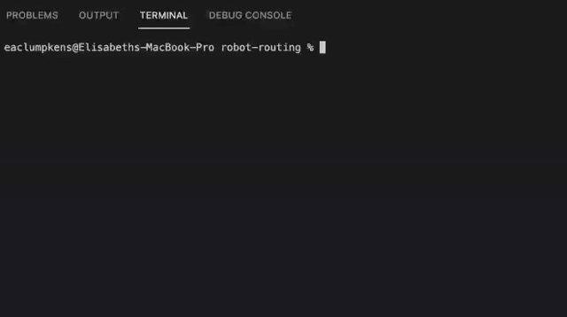
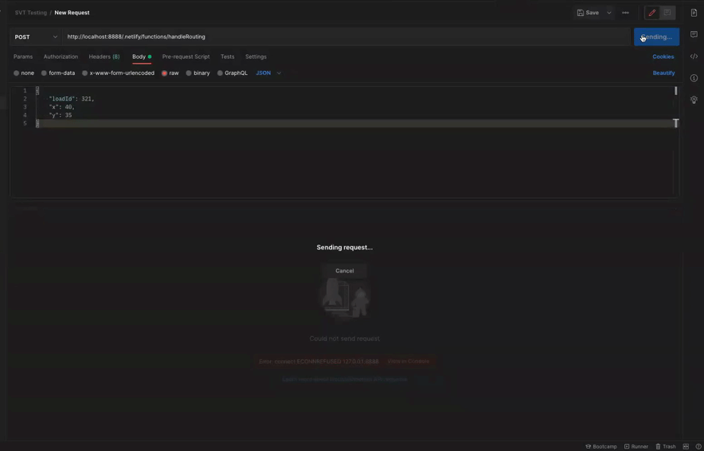

## Table of Contents

- [Concept](#concept)
- [Technologies](#technologies)
- [Installation](#installation)
- [Testing](#testing)
- [Future Developments](#future-developments)
- [Links and Screenshots](#links-and-screenshots)
- [Created By](#created-by)
- [License](#license)

## Concept

API POST endpoint: receives a list of 100 robots from API GET request, providing their current position on an xy-plane along with battery life. The endpoint returns which robot is the best to transport the load based on which is closest to the load's location. If there is more than 1 robot within 10 distance units of the load, the robot with the highest battery level is returned.

## Technologies

- JavaScript
- NodeJS/NPM
- Netlify

## Installation

To use this project, first clone and navigate to the project repo in your terminal using the commands below:

```
$ git clone https://github.com/eaclumpkens/robot-routing.git
$ cd ./robot-routing
```

Once the repo is cloned and you've ensured you are in the correct repo, if not previously installed, run the following code to install NPM & Netlify's CLI:

```
$ npm install npm -g
$ npm install netlify-cli -g
```

Install NPM packages:

```
$ npm i
```

To start the server locally, run the following command:

```
$ ntl dev
```



Ensure server is running locally at http://localhost:8888/ or appropriate port


## Testing

Create POST request using API Platform such as Postman, ensuring the request body is valid JSON, for example:

```
{
  "loadId": 321,
  "x": 40,
  "y": 35
}

```

Payload response should be displayed as following: 


## Future Developments

**Automated Testing**

Implement a library such as JestJS or otherwise facilitate automated testing

**Prod Endpoint**

POST API requests to live URL rather than necessitating local hosting

**.Net**

I'd like to be able to recreate this project using the .Net framework

**Additional Error Handlings**

Ensure all edge cases are handled and try/catches used appropriately. I feel as if there are always more to be accounted for.


## Created by

[Elisabeth Clumpkens](mailto:eaclumpkens@gmail.com)

## License

[](https://opensource.org/licenses/MIT)
